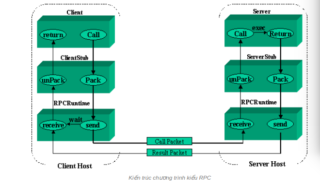
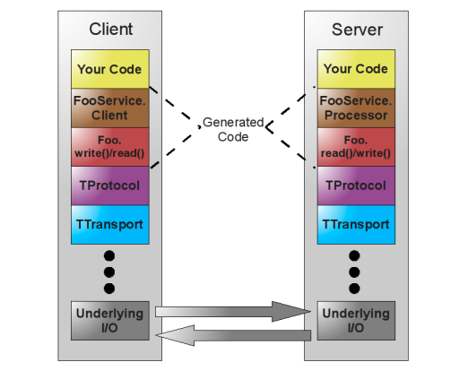
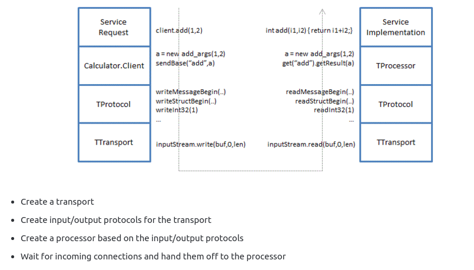

# APACHE THRIFT

### 1. RPC (Remote procedure call)

Apache Thrift là một framework của RPC. RPC được hiểu như là thủ tục gọi hàm từ  xa.

Có 2 dạng thủ tục: thủ tục cục bộ và thủ tục ở xa. Cú pháp để gọi hai loại thủ tục là như nhau. Tuy nhiên sự khác nhau giữa hai loại thủ tục là:

Thủ tục cục bộ: được định nghĩa, cài đặt và thực thi trên máy tính của chương trình.

Thủ tục từ xa: được định nghĩa, cài đặt và thực thi trên máy tính khác không chạy chương trình.

Khi lập trình viên gọi một thủ tục ở xa, một thành phần của chương trình được gọi là **stub** của chương trình sẽ chuyển hướng đến một thủ tục nằm trên một máy tính khác.

Điểm lợi ở đây là cơ chế đơn giản hóa cho việc xây dựng các ứng dụng Client-Server, Server sẽ là các máy chủ để cung cấp các thủ tục từ xa cho phép các chương trình khác gọi thực hiện, Client sẽ là các chương trình gọi đến các thủ tục ở xa trong quá trình thực hiện của mình.

### 2. APACHE THRIFT

**Mô tả chung**

Apache thrift là một tập các công cụ giúp xây dựng RPC Client và Server bằng cách định nghĩa kiểu dữ liệu và các service interface trong một file định nghĩa. Code sẽ được tự động sinh từ dữ liệu đầu vào của file này, tạo ra một RPC Server client có thể giao tiếp dễ dàng với nhau trên nền tảng nhiều ngôn ngữ (ActionScript, C, C++, C#, Cappuccino, Cocoa, Delphi, Erlang, Go, Haskell, Java, Node.js, Objective-C, OCaml, Perl, PHP, Python, Ruby và Smalltalk)

Ngôn ngữ để viết nên file định nghĩa phía trên được gọi là Thrift IDL (interface Definition Languge)

**Kiến trúc Thrift**

Thrift bao gồm một stack hoàn chỉnh cho việc tạo server và client theo RPC.

Thrift Protocol Stack có thể xem gồm các thành phần: 

* **TTransport**

Component này cho phép việc ghi đọc các gói tin tách thrift ra khỏi các phần dư trong quá trình truyền tin.

* **TProtocol**

Giúp serialize và deserialize các loại data được sử dụng trong tầng transport (ví dụ: XML, văn bản thường, binary,...)

*Protocol và transport là các phần trong runtime library của thrift* vì vậy ta có thể định nghĩa service và tự do thay đổi giao thức mà không cần phải sinh lại code.

* **Processor**

Gồm 2 phần (FooService & Foo.write()/read())  có nhiệm vụ xử lý các yêu cầu (nhận các thông số đầu vào, xử lý thông qua Handler được định nghĩa sau đó trả về vào đầu ra)

Phần code trên cùng là phần code được sinh ra từ file định nghĩa Thrift.

***SERVER*** 

là tập hợp 3 tính năng được liệt kê ở trên:

### 3. Cài đặt và demo

* **Cài đặt**

	* Cài ant để build Thrift:

	> sudo apt-get install ant
	
	* Cài các thư viện cần thiết:
	
	> sudo apt-get install libboost-dev libboost-test-dev libboost-program-options-dev libboost-
filesystem-dev libboost-thread-dev libevent-dev automake libtool flex bison pkg-config g++ libssl-dev

	* Tải Thrift compiler từ trang chủ giải nén và build

	> sudo make

	* Install

	> sudo make install

	* Check version

	> thrift -version

 

